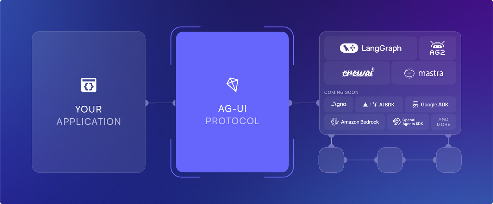

# Full-Stack Agentic Experience

This demo repo uses Copilotkit & Langgraph to build agentic experiences that sync chat & visual experiences.

It achieves this by synching the state between the Langgraph Backend & React Frontend.



# About the app

Mini full-stack app that fetches CVE data from NVD, calculates risk scores, and displays results in a React dashboard.

## Stack

- Backend: Node.js + Express + TypeScript
- Frontend: React + TypeScript + Vite
- AI Agent: Langgraph

## AI copilot (CopilotKit + LangGraph)

The dashboard includes a **Risk copilot** sidebar (CopilotKit) that talks to the `cyber_risk` LangGraph agent. The agent updates shared state (`severity_filter`, `vendor_filter`) so the table and filters stay in sync when you ask things like “show only critical CVEs” or “filter vendor to Microsoft”.

## Getting Started

*Step 1: Setup .env files*

Setup <a href=".env.example">.env</a> and <a href="agents/copilotkit/agent/.env.example">agents/copilotkit/agent/.env</a> files based on their corresponding example files.

*Step 2: Load sample data into Supabase via script*

```bash
npm run sync:nvd
```

(Uses `tsx` under the hood. Running `node scripts/syncNvdToSupabase.ts` will fail because Node does not execute TypeScript or resolve `.ts` imports.)

*Step 3: Running JavaScript Frontend & Backend & Langgraph AI Agent*

Install dependencies:

```bash
npm install
```

Run backend:

```bash
npm run dev:backend
```

Run frontend in another terminal:

```bash
npm run dev:frontend
```

Backend runs on `http://localhost:3001`, frontend on `http://localhost:5173`.

You can also run both with:
```bash
npm run dev:all
```

You'll also want to spin up the langgraph agent server based on the <a href="AGENTS_README.md">guidelines in AGENTS_README.md</a>


## UI Features

- Vulnerability table with columns: CVE ID, Description, Severity, Risk Score, Date
- Severity filter
- Sort by risk score (high-to-low / low-to-high)
- Risk score indicator colors:
  - Green `0-30`
  - Yellow `31-60`
  - Orange `61-80`
  - Red `81-100`
- Stats panel for severity counts and top vendors
- Copilot sidebar for natural-language filtering (severity / vendor) backed by the same REST API

## AI Tools Usage

- **Tool used**: Cursor AI assistant
- **Used for**:
  - scaffolding backend and frontend structure
  - implementing API integration and risk scoring logic
  - generating initial React UI components
  - writing initial unit tests

## Risk Score Formula

Score range is `0-100`.

- `CVSS contribution (60%)`: `min(max(cvss,0),10) * 10 * 0.6`
- `Exploitability contribution (20%)`: `min(max(exploitability,0),10) * 10 * 0.2`
- `Age contribution (20%)`: Newer vulnerabilities score higher.
  - `ageFactor = (1 - min(ageDays, 365)/365) * 100`
  - `age contribution = ageFactor * 0.2`

Final score:

`riskScore = round(cvssNorm*0.6 + exploitabilityNorm*0.2 + ageFactor*0.2)`

## API Endpoints

- `GET /api/vulnerabilities` - list vulnerabilities
- `GET /api/vulnerabilities?severity=HIGH` - list filtered by severity
- `GET /api/vulnerabilities/:id` - single vulnerability details by CVE ID
- `GET /api/stats` - severity breakdown + top vendors
- `GET /api/health` - app health + Supabase connectivity check
- `POST /api/copilotkit` - CopilotKit runtime (streams to the LangGraph `cyber_risk` agent)

## Tests

Run tests:

```bash
npm test
```

Includes 3 unit tests for:

- relative risk scoring behavior
- severity normalization
- vendor parsing from CPE